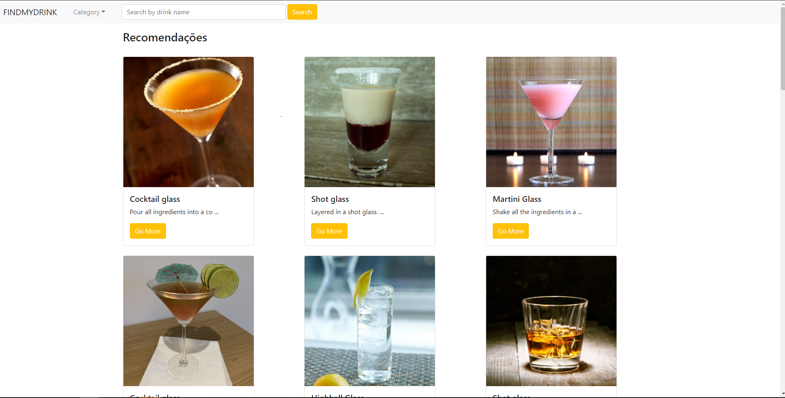

<h1 align="center"></img></h1>

# FindMyDrink

O Projeto foi desenvolvido para consumo de api do site TheCockTail que é um serviços de buscas com api free para desenvolvimento.

Link em Produção: https://hungry-aryabhata-c01b3a.netlify.app/

# ✋🏻 Pré-requisitos

- [Node.js](https://nodejs.org/en/)
- [Yarn](https://yarnpkg.com/getting-started/install)

## Features

Para o desenvolvimento do projeto foi utilizada uma stack com as seguintes tecnologias:

- ⚛️ **React Js** — Livraria Javascript para construção de interfaces;
- [Axios](https://github.com/axios/axios) - Axios é um cliente HTTP baseado em promessa para node.jse o navegador. É isomórfico (= pode ser executado no navegador e no nodejs com a mesma base de código). No lado do servidor, ele usa o httpmódulo node.js nativo , enquanto no cliente (navegador) ele usa XMLHttpRequests.

## 🔥 Instalação e execução com npm ou yarn

1. Faça um clone desse repositório;
2. Entre na pasta do projeto;
3. Execute `npm install` ou `yarn install` para instalar as dependências;
4. Na pasta raiz execute `npm start` ou `yarn start` pra iniciar o servidor de desenvolvimento na porta http://localhost:3000;
